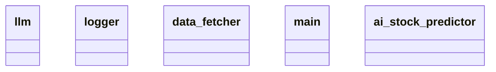

# Architecture Document

## Overview

The architecture of the AI Stock Predictor involves several key components that work together to predict stock prices based on historical data. Each component has a specific role, and together they form the backbone of the application.

## Component Design

### 1. LLM (Language Learning Model)
- **Purpose**: The core model that analyzes data and generates predictions based on learned patterns.
- **Responsibilities**:
  - Process input data and generate outputs.
  - Adapt and learn from new data.

### 2. Logger
- **Purpose**: Responsible for logging the system's activities and errors for monitoring and debugging.
- **Responsibilities**:
  - Capture and store logs of predictions made.
  - Record errors encountered during the execution.

### 3. Data Fetcher
- **Purpose**: A service responsible for retrieving historical stock data from various sources.
- **Responsibilities**:
  - Connect to APIs or databases to fetch relevant stock data.
  - Process incoming data and prepare it for analysis.

### 4. Main
- **Purpose**: This is the entry point of the application which orchestrates the flow between various components.
- **Responsibilities**:
  - Initialize and configure the application components.
  - Manage the data flow between the Fetcher, LLM, and Logger.

### 5. AI Stock Predictor
- **Purpose**: The high-level component that coordinates everything to provide stock predictions.
- **Responsibilities**:
  - Utilize the LLM for predictions.
  - Use the Data Fetcher for acquiring new data.
  - Log predictions through the Logger.

## Class Diagram

The following Mermaid class diagram illustrates the relationships and structure of the components:

## Conclusion

This architecture provides a structured approach to building the AI Stock Predictor application, allowing for scalability, maintainability, and efficient data processing. Each component plays a crucial role in ensuring that the system performs optimally while providing accurate predictions.