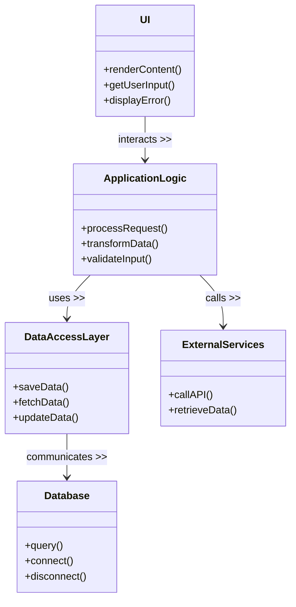

# Architecture Document

## Overview
This document outlines the component design of the system, focusing on its architecture and relationships among different components. The architecture is designed to ensure scalability, maintainability, and flexibility.

## Component Design

### 1. User Interface (UI)
- **Description**: The User Interface is responsible for user interaction. It displays data and receives user inputs.
- **Responsibilities**:
  - Render and display content to the user.
  - Capture user inputs and validate them.
  - Interact with the backend services to fetch or send data.

### 2. Application Logic
- **Description**: This component contains the business logic of the application.
- **Responsibilities**:
  - Process user requests.
  - Handle data transformations.
  - Coordinate between the UI and data access layers.
  
### 3. Data Access Layer
- **Description**: This component interacts directly with the database.
- **Responsibilities**:
  - Perform Create, Read, Update, and Delete (CRUD) operations.
  - Abstract the complexity of database queries.
  - Manage database connections.

### 4. Database
- **Description**: The persistent storage for the application.
- **Responsibilities**:
  - Store user data and application state.
  - Ensure data integrity and reliability.
  - Support complex queries.

### 5. External Services
- **Description**: Integration points for external APIs or third-party services.
- **Responsibilities**:
  - Fetch data not stored within the application.
  - Provide additional functionalities, such as payment processing, geolocation, etc.

## Class Diagram
The following Mermaid class diagram illustrates the relationships among the components described above.

## Conclusion
This architectural design provides a clear structure for developing and maintaining the system. Each component's responsibilities are well-defined to allow for modular development and future enhancements.