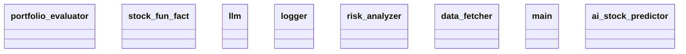

# Architecture Documentation

## Component/Module Design

The codebase is structured around several key components/modules, each serving a distinct function within the overall architecture:

1. **portfolio_evaluator**: This module is likely responsible for assessing the performance of investment portfolios. It may integrate data analysis and reporting functionalities to provide insights on the profitability and risks associated with different portfolios.

2. **stock_fun_fact**: This module could provide interesting facts or trivia about various stocks. It might be aimed at engaging users or providing additional context for stock evaluations.

3. **llm**: This module presumably refers to a large language model, which could be involved in processing natural language queries, generating textual descriptions, or making predictions based on the data received from other components.

4. **logger**: The logger component is essential for tracking events within the system. It likely deals with logging important information, debugging data, or recording any anomalies observed during execution, ensuring a traceable flow of information for maintenance and auditing.

5. **risk_analyzer**: This module is designed to evaluate the risk associated with investments. It may analyze market trends, historical data, and other relevant indicators to provide insights on potential risks to the portfolio.

6. **data_fetcher**: The data_fetcher module is responsible for gathering data from external sources or databases. This is crucial for providing up-to-date information required for analysis and evaluation by other components.

7. **main**: The main module likely serves as the entry point of the application, coordinating the interactions between different components and managing the overall workflow.

8. **ai_stock_predictor**: This module probably leverages algorithms or machine learning models to predict stock market trends or stock prices, aiding users in making informed investment decisions.

## Module Relationships and Interactions

The relationships and interactions between the modules can be summarized as follows:

- **main** acts as the orchestrator, calling upon all other modules such as **data_fetcher**, **portfolio_evaluator**, **risk_analyzer**, **ai_stock_predictor**, and potentially others to execute its functionalities.
  
- **data_fetcher** feeds data into the **portfolio_evaluator** and **risk_analyzer**, ensuring that these modules have the necessary information to perform their assessments.

- **logger** interacts with all modules to provide a comprehensive logging mechanism that records various events and actions undertaken throughout the system.

- **llm** may interact with **ai_stock_predictor** to process queries or leverage language understanding capabilities to enhance predictions or data presentations.

- **stock_fun_fact** could provide supplementary information to users, possibly interfacing with **portfolio_evaluator** or **ai_stock_predictor** to deliver context around stock evaluations.

- **risk_analyzer** uses data, possibly fetched by **data_fetcher**, to assess risks and may pass its analysis results back to **portfolio_evaluator** for integrated reporting.

## Generated Mermaid Diagram

### Diagram Explanation

The provided Mermaid diagram illustrates the different modules in the system as classes. Each class represents a distinct module within the application. The lines between the classes (not visible in this textual representation) would typically represent relationships such as dependencies, interactions, or inheritance. 

However, the specific details of these relationships (such as whether they are associations, compositions, etc.) are not clearly defined in the diagram itself, preventing a complete relational analysis based on visual cues alone. Therefore, the explanation focuses only on what can be observed and deduced from the module descriptions provided earlier.