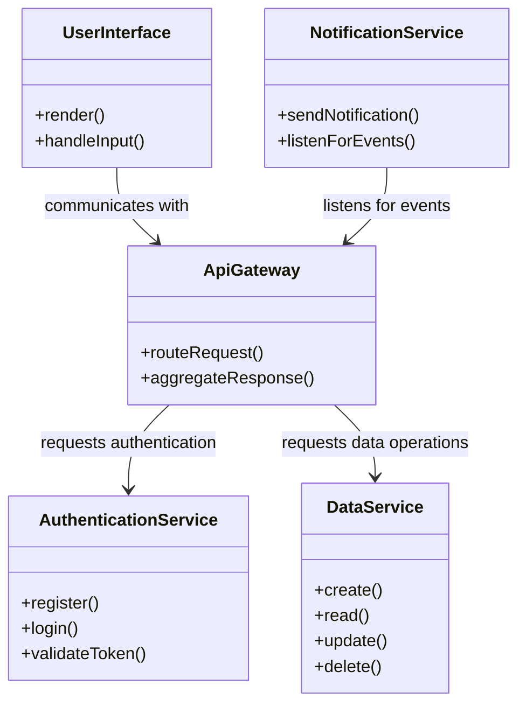

# Architecture Document

## Overview

This architecture document outlines the design of a modular software system. The system is designed to be scalable, maintainable, and easy to understand. It leverages a component-based architecture that separates concerns and allows for independent development and deployment of each component.

## Component Design

### Components

1. **User Interface (UI) Component**
   - **Purpose**: Responsible for rendering the user interface and handling user interactions.
   - **Technologies**: React.js (or any other front-end framework)
   - **Responsibilities**:
     - Display data provided by the API.
     - Handle user input and events.

2. **API Gateway Component**
   - **Purpose**: Acts as a mediator between the UI and backend services.
   - **Technologies**: Node.js/Express
   - **Responsibilities**:
     - Route requests to appropriate backend services.
     - Aggregate responses from multiple services if necessary.

3. **Authentication Service**
   - **Purpose**: Handles user registration, login, and authentication.
   - **Technologies**: OAuth 2.0, JWT
   - **Responsibilities**:
     - Validate user credentials.
     - Issue tokens for authenticated sessions.

4. **Data Service**
   - **Purpose**: Interacts with the database to perform CRUD operations.
   - **Technologies**: MongoDB/PostgreSQL
   - **Responsibilities**:
     - Store and retrieve data as requested by the API Gateway.
     - Ensure data integrity and security.

5. **Notification Service**
   - **Purpose**: Manages sending notifications to users based on specific events.
   - **Technologies**: RabbitMQ/Kafka for messaging
   - **Responsibilities**:
     - Receive events and push notifications through various channels (e.g., email, SMS).

## Class Diagram

The following class diagram illustrates the relationships and structure of the main components.

## Conclusion

This architecture provides a clear, well-defined structure for developing the software system. Each component has specific responsibilities and can be developed and deployed independently, promoting scalability and maintainability. Future enhancements can be easier to implement as new components can be added or existing components can be updated without affecting the entire system.