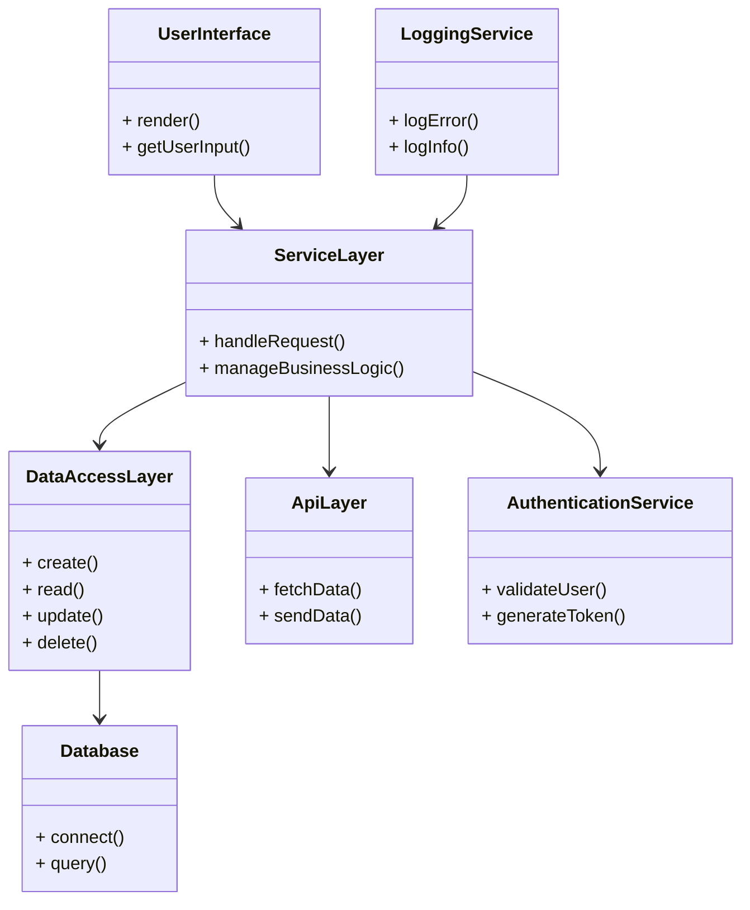

# Architecture Document

## Overview

This document outlines the component design for our software solution. The architecture is designed to provide scalability, maintainability, and performance. It incorporates both structural and behavioral components, ensuring a clear interaction model and defined responsibilities.

## Component Design

### 1. **User Interface (UI) Layer**
   - **Description**: Responsible for rendering the user interface and capturing user input.
   - **Technologies Used**: React, Bootstrap.

### 2. **Service Layer**
   - **Description**: Contains business logic and handles communication between the UI and data storage layers.
   - **Technologies Used**: Node.js, Express.

### 3. **Data Access Layer**
   - **Description**: Interfaces with the database to perform CRUD operations and retrieve data.
   - **Technologies Used**: Sequelize ORM, PostgreSQL.

### 4. **Database**
   - **Description**: Where all persistent data is stored and managed.
   - **Technologies Used**: PostgreSQL Database.

### 5. **API Layer**
   - **Description**: Exposes RESTful APIs for communication between the frontend and backend.
   - **Technologies Used**: Express, JWT for authentication.

### 6. **Authentication Service**
   - **Description**: Handles user authentication and authorization.
   - **Technologies Used**: JSON Web Tokens, Passport.js.

### 7. **Logging and Monitoring Service**
   - **Description**: Manages logs and system metrics.
   - **Technologies Used**: Winston, Prometheus for monitoring.

## Component Interaction

- The UI Layer communicates with the Service Layer to perform business operations.
- The Service Layer interacts with the Data Access Layer to fetch or manipulate data.
- The API Layer facilitates requests from the UI to the Service Layer and returns responses.
- The Authentication Service verifies user credentials and issues tokens for session management.

## Class Diagram

Below is the class diagram representing the components and their relationships:

## Conclusion

The architecture outlined in this document provides a solid foundation for developing a scalable and maintainable application. The component design supports clear responsibilities and interactions between different layers, facilitating a modular approach to software development.