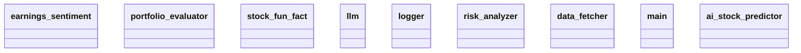

# Architecture Documentation

## Component/Module Design

The system is structured around several key modules, each responsible for a specific aspect of functionality:

1. **earnings_sentiment**: This module appears to handle sentiment analysis related to earnings reports. It likely processes data surrounding corporate earnings to gauge market sentiment.

2. **portfolio_evaluator**: This module is designed to assess the user's portfolio, potentially providing insights into performance metrics and investment strategies.

3. **stock_fun_fact**: This module may generate or fetch interesting facts about stocks, enhancing user interactions with engaging information.

4. **llm**: Although not explicitly detailed, the "llm" module is likely related to a language model, which could be utilized for generating textual outputs or analysis based on data provided by other modules.

5. **logger**: This module is responsible for logging events, errors, and other significant actions within the system, which is crucial for debugging and monitoring.

6. **risk_analyzer**: This module appears to focus on assessing the risk associated with different investments or the overall portfolio, providing insights into risk management.

7. **data_fetcher**: As the name suggests, this module is responsible for obtaining data from external sources, which is essential for feeding other components with the latest information.

8. **main**: This module typically serves as the entry point or orchestrator of the application, coordinating interactions among the other modules.

9. **ai_stock_predictor**: This module is likely focused on providing stock predictions powered by artificial intelligence, utilizing data from other modules to make informed forecasts.

## Module Relationships and Interactions

The relationships among the modules aren't explicitly defined in the provided context, leading to some ambiguity. However, we can infer potential interactions based on the likely roles of the components:

- **data_fetcher** likely interacts with both **earnings_sentiment** and **ai_stock_predictor**, supplying them with the necessary data for analysis and prediction.
- **portfolio_evaluator** may utilize outputs from **risk_analyzer** to assess the performance and risk levels of the portfolios it evaluates.
- The **logger** will be systematically employed across all modules to track operations and issues.
- The **llm** module might be invoked by the **ai_stock_predictor** or could assist **stock_fun_fact** in generating narratives or descriptions.

While these relationships are inferred, explicit interaction pathways or dependencies haven't been illustrated in the provided diagram or description, highlighting an area for potential detail enhancement.

## Mermaid Class Diagram

Below is the generated class diagram representing the modules within the system:

This diagram visually summarizes the key components of the system without specifying the relationships among them, leaving room for further clarity on how each module interacts within the architecture.