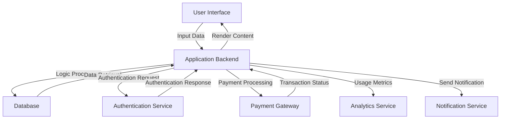

It seems that there is no specific information available regarding the data or information flows within an application at this time. However, I can outline a template for how to analyze information flows that you might find useful. Below is a general description of potential information flows you might consider in an application:

### Example Information Flow Analysis

#### Internal Application Flows

1. **User Input to Application**
   - **Source:** User Interface
   - **Destination:** Application backend
   - **Data Type:** User data (forms, selections)
   - **Purpose:** To collect data needed for further processing.

2. **Application Logic to Database**
   - **Source:** Application backend
   - **Destination:** Database
   - **Data Type:** Structured data (e.g., SQL queries)
   - **Purpose:** To store and retrieve user data, application states, etc.

3. **Database to Application Response**
   - **Source:** Database
   - **Destination:** Application backend
   - **Data Type:** Query results
   - **Purpose:** To provide requested data to the application for user display or logic processing.

4. **Application to User Interface**
   - **Source:** Application backend
   - **Destination:** User Interface
   - **Data Type:** Rendered content (HTML, JSON)
   - **Purpose:** To present processed data to the user.

#### External System Flows

1. **Application to Authentication Service**
   - **Source:** Application backend
   - **Destination:** External Authentication Service
   - **Data Type:** Authentication credentials
   - **Purpose:** To verify the identity of the user.

2. **External Service to Application**
   - **Source:** Third-party API (e.g., payment gateway)
   - **Destination:** Application backend
   - **Data Type:** Payment confirmation, transaction success/failure
   - **Purpose:** To inform the application of the status of a transaction.

3. **Application to Analytics Service**
   - **Source:** Application backend
   - **Destination:** External Analytics Service
   - **Data Type:** Usage metrics, user interactions
   - **Purpose:** To collect data for analyzing application usage and performance.

4. **Application to Notification Service**
   - **Source:** Application backend
   - **Destination:** External Notification Service
   - **Data Type:** Notification data (e.g., emails, push notifications)
   - **Purpose:** To send alerts or notifications to users based on application events.

### Mermaid Flowchart

Here is an example of how you might visualize these flows using Mermaid syntax:

Please adapt this example according to the specific flows relevant to your application. If you have more specific details regarding your application or its data flows, I'd be happy to provide a more tailored analysis.