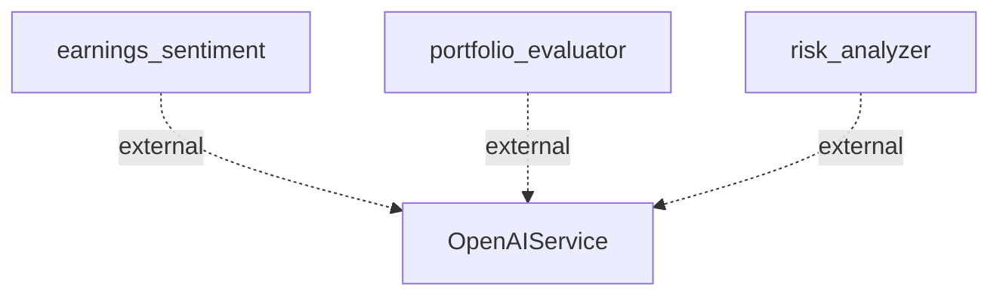

## Information Flows Description

### 1. Earnings Sentiment Flow
- **Source:** earnings_sentiment
- **Destination:** OpenAIService
- **Data Type:** Sentiment Analysis Data
- **Purpose:** To send earnings sentiment data for external analysis or processing using the OpenAI API. 

### 2. Portfolio Evaluator Flow
- **Source:** portfolio_evaluator
- **Destination:** OpenAIService
- **Data Type:** Portfolio Evaluation Data
- **Purpose:** To transmit portfolio evaluation metrics for further examination or enhancement through OpenAI's services.

### 3. Risk Analyzer Flow
- **Source:** risk_analyzer
- **Destination:** OpenAIService
- **Data Type:** Risk Assessment Data
- **Purpose:** To convey risk assessment information for additional analysis or recommendations by OpenAI.

### Mermaid Flowchart
