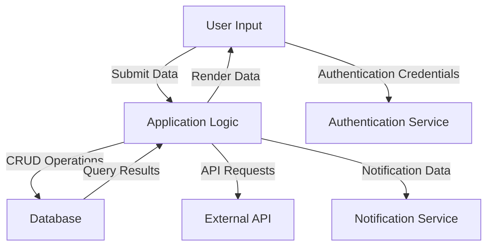

It appears that I currently do not have specific information about the application to analyze its data or information flows. However, I can provide a general approach to describe information flows in an application.

**Information Flows Overview:**
1. **Flows Within the Application:**
   - **User Input to Frontend:** 
     - **Source:** User (UI)
     - **Destination:** Application Logic
     - **Data Type:** User Input Data (e.g., Forms, Commands)
     - **Purpose:** Receive and process user commands or data submissions.

   - **Application Logic to Database:**
     - **Source:** Application Logic
     - **Destination:** Database
     - **Data Type:** CRUD Operations (Create, Read, Update, Delete)
     - **Purpose:** Store, retrieve, and manipulate application data.

   - **Database to Application Logic:**
     - **Source:** Database
     - **Destination:** Application Logic
     - **Data Type:** Query Results
     - **Purpose:** Provide data to the application logic for processing and displaying to the user.

   - **Application Logic to Frontend:**
     - **Source:** Application Logic
     - **Destination:** User (UI)
     - **Data Type:** Rendered Data/Responses
     - **Purpose:** Send processed data back to the user interface for display.

2. **Flows to/from External Systems:**
   - **User Authentication Service:**
     - **Source:** User (UI)
     - **Destination:** Authentication Service
     - **Data Type:** Authentication Credentials
     - **Purpose:** Verify user identity before granting access.

   - **Third-party API Integration:**
     - **Source:** Application Logic
     - **Destination:** External API
     - **Data Type:** API Requests
     - **Purpose:** Retrieve or send data to external systems (e.g., payment processing, data services).

   - **Notification Service:**
     - **Source:** Application Logic
     - **Destination:** Notification Service (e.g., Email, SMS)
     - **Data Type:** Notification Data
     - **Purpose:** Send alerts or notifications to users based on specific triggers/events.

**Mermaid Flowchart Visualization:**

This is a general framework. For a more accurate representation, please provide details about the specific application, and I would tailor the flows accordingly.