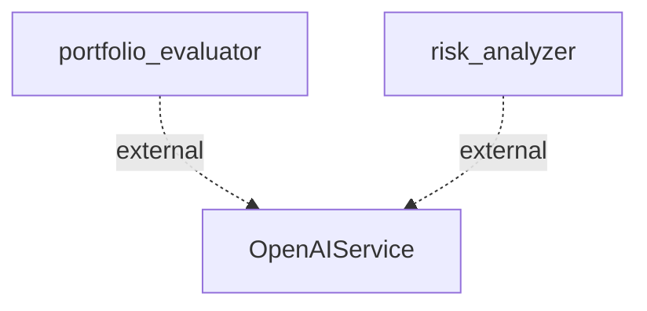

# Information Flows Documentation

## Information Flows

### 1. Flow from `portfolio_evaluator` to `OpenAIService`
- **Source:** portfolio_evaluator
- **Destination:** OpenAIService
- **Data Type:** Unknown (presumably analytical data related to portfolio evaluation)
- **Purpose:** The flow likely serves to obtain insights or recommendations from an external AI service regarding portfolio evaluation.

### 2. Flow from `risk_analyzer` to `OpenAIService`
- **Source:** risk_analyzer
- **Destination:** OpenAIService
- **Data Type:** Unknown (presumably data related to risk analysis)
- **Purpose:** This interaction suggests a request for assessments or predictions from an external AI service, focusing on risk factors.

## Flowchart

